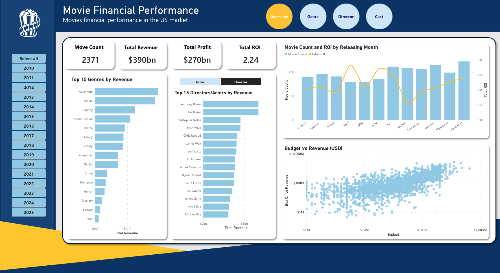
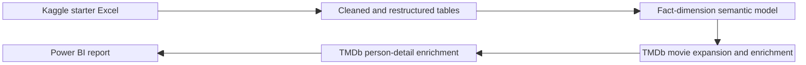

# Movie Financial Performance Dashboard

A personal, non-commercial Power BI portfolio project that turns a movie
spreadsheet exercise into a reproducible analytics pipeline and semantic model.
The project began with a
[Kaggle starter Excel workbook](https://www.kaggle.com/datasets/derrickmallison/movie-data-starter-project-pivot-table-and-chart),
restructured its data into fact and dimension tables, and then expanded and
enriched the dataset with the TMDb API.

## Dashboard

**Power BI file:** [Download `MoviesDashboard.pbix`](assets/MoviesDashboard.pbix)



*The overview summarizes movie count, revenue, profit and ROI, with comparisons
across genres, directors or actors, release months, budgets and box-office
revenue. All visuals respond to the release-year filter.*

## Report Pages

### Genre Analysis


*The genre page compares movie volume, revenue, profit and ROI. Multi-select
genre controls support comparisons across release timing, financial scale and
average return.*

### Director Details


*The director page combines financial KPIs with a selected director's profile,
biography and filmography. The movie table includes budget, revenue, profit,
ROI and rating.*

### Cast Details


*The cast page provides the same person-level experience for actors, linking a
profile and biography to the movies and financial results available in the
curated dataset.*

### Movie Tooltips


*Hover tooltips add a compact movie snapshot with title, tagline, overview and
poster without requiring a separate report page.*

## Data Journey



The project was developed in phases:

1. The starter workbook was profiled and reshaped into staging, fact, dimension
   and bridge tables.
2. TMDb became the primary source for a larger, cleaner movie sample, including
   movie details, credits, genres, posters and external identifiers.
3. Person details were added separately so biographies, birth information and
   profile images could enrich the Director and Cast pages without widening the
   core person dimension.
4. The generated CSV tables were loaded into a Power BI semantic model and used
   to build the interactive report.

## Semantic Model


*The model separates movie performance measures from descriptive dimensions.
Bridge tables resolve the many-to-many relationships between movies and genres
and between movies and credited people. Optional person details connect to
`dim_person` through `person_key`.*

Power BI loads these model tables from `data/processed/`:

- `dim_movie.csv`
- `fact_movie_performance.csv`
- `dim_genre.csv`
- `bridge_movie_genre.csv`
- `dim_person.csv`
- `dim_person_detail.csv`
- `bridge_movie_credit.csv`
- `dim_date.csv`

`movie_identity_map.csv` is retained as an optional matching and QA reference.

## Current Dataset

The generated dataset is a curated TMDb sample covering releases from
`2010-2025`.

- Movies: `2,371`
- Target depth: `150` clean, revenue-sorted movies per year
- Current exception: `2020` contains `121` movies after cleaning
- Deduplication: one movie per `tmdb_id`
- Minimum budget: `$1M`
- Required movie fields: title, release date, runtime, revenue, budget, genre,
  director and cast
- Enriched people: `7,007`

This is a clean analytical sample rather than a complete movie catalog.

## Pipeline

TMDb responses are cached locally, normalized into staging CSVs and transformed
into stable Power BI tables. The raw workbook and API cache remain local. More
detail is available in [source notes](docs/source_notes.md) and the
[data dictionary](docs/data_dictionary.md).

Create the environment and add a TMDb bearer token to a local `.env` file:

```bash
mamba env create -f environment.yml
conda activate movie-dashboard
```

```text
TMDB_BEARER_TOKEN=your_token_here
```

Run the TMDb-first pipeline:

```bash
python -m src.load_tmdb_seed
python -m src.build_model
python -m src.enrich_tmdb
python -m src.build_model
python -m src.enrich_tmdb_people
python -m src.validate
```

The original starter-workbook loader remains available for comparison or
backfill work:

```bash
python -m src.load_seed
python -m src.build_model
python -m src.validate
```

## Project Structure

```text
assets/          Power BI file, report screenshots and logo assets
data/manual/     reviewed corrections and TMDb match overrides
data/processed/  generated CSV tables for Power BI
data/raw/        local-only workbook and TMDb API cache
docs/            data dictionary and source notes
src/             ingestion, enrichment, modeling and validation code
tests/           focused pipeline tests
```

## Reproducibility Notes

- `.env`, `data/raw/` and the TMDb API cache are not committed.
- Generated publishable CSVs are stored in `data/processed/`.
- The raw starter workbook is excluded because redistribution rights are
  unclear.
- The PBIX file is provided as a report artifact; the Python pipeline is the
  reproducible source for the underlying dataset.
